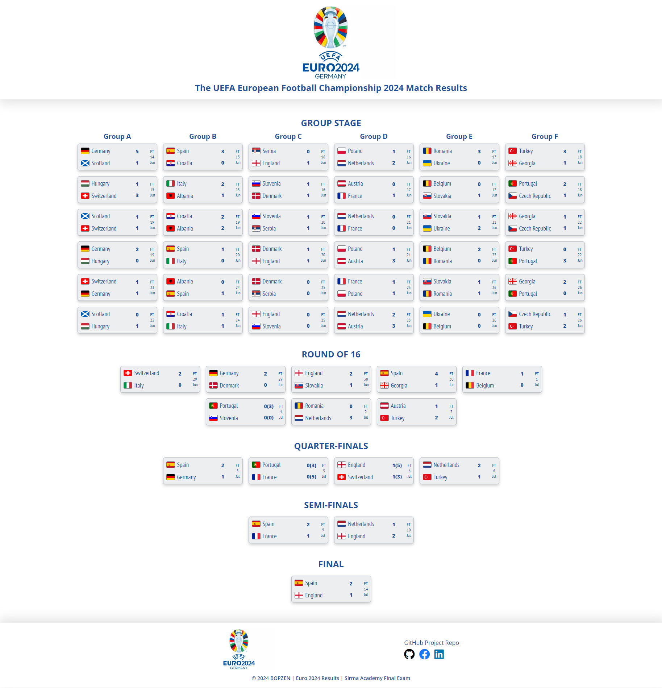
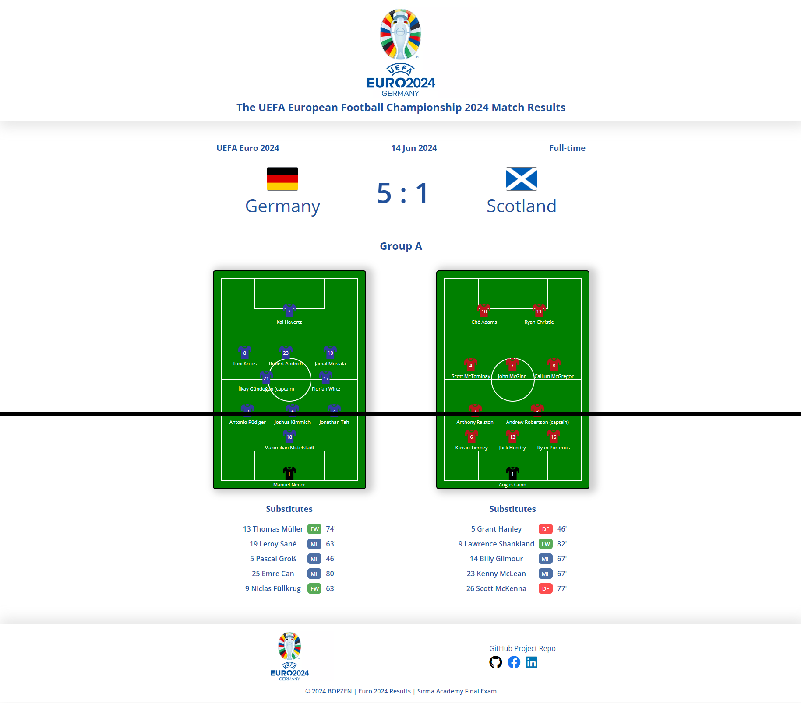
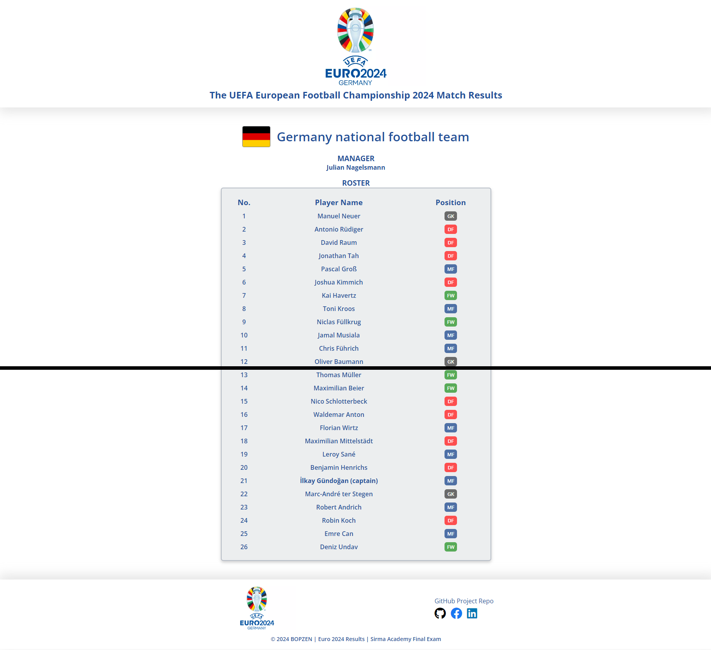
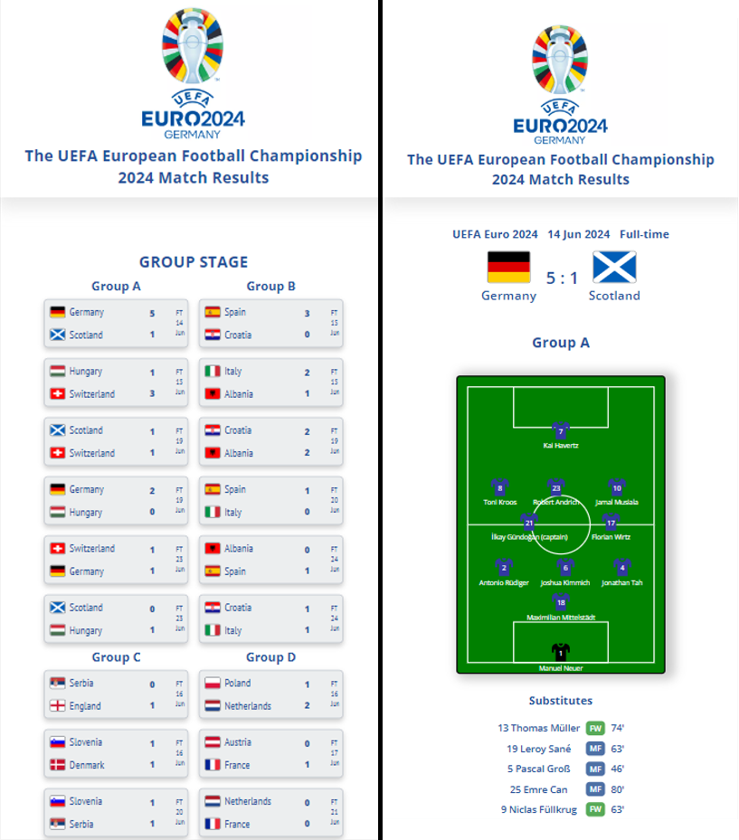

# Euro 2024 Results

# This is my final exam defense project for Sirma Academy JS Front-End 2024 course.

#### **Euro2024Results** is a web application developed with React. The main purpose of the application is to show the UEFA European Football Championship 2024 match results, match details with teams lineup and team details with roster.

## Short Functionality Description:

- The website shows the result from all matches in the group stages, followed by all the matches from every final stage: Round of 16, Quarter-finals, Semi-finals and Final.
- Each match has details page with the result, followed by each team's lineup visualized on the field.
- Each team has details showing the manager of the team and the roster info.

[Requirements document Sirma_Academy_JS_2024_Final_Project_Assignment.pdf](Sirma_Academy_JS_2024_Final_Project_Assignment.pdf)

## How to start project locally:
- Clone the repo on your PC: `git clone https://github.com/bopzen/Euro2024Results.git`.
- From the main folder of the app run: `npm install` to install the dependencies.
- From the main folder of the app run: `npm run dev` to run the app
- By default the app will open on port if available: `http://127.0.0.1:5173/`.

## Main Functionality Description:
- The website uses basic **CSV** files for data that need to be parsed and the required information needs to be extracted using the relations based on IDs similar to how a relative DB would work `matches.csv`, `players.csv`, `records.csv`, `teams.csv`.
By resuirement the use of external parsing libraries is not allowed, so the main approach used here is to create `utils.js` file in the app with utils functions that read the raw data from CSV file and store it in array, then use other functions that get the raw data and create match, teams, players objects populated with the needed info based on the relations of the IDs.

- The needed data from the CSV is then rendered on the different React components. The app consists of **9** components:
`Home.jsx`, `Header.jsx`, `Footer.jsx`, `GroupMatches.jsx`, `MatchResult.jsx`, `MatchDetails.jsx`, `TeamDetails.jsx`, `TeamLineUp.jsx`, `NotFound.jsx`.

- The data rendering in the components is based on simple approach using `useState` and `useEffect` built-in hooks.

- The components build **3** main pages: `Homepage - List of all matches`, `Match Details` and `Team Details`.

- The application uses **React Router** to navigate to each page and Match Details and Team Details pages use params to show different matches and teams based on the match/team ID: `/match/:matchID`, `/team/:teamID`.

- **CSS** styling: No libraries are used for the styling just pure CSS. Additional country flag icons are added in order to show flags for each team. The lineup football field and players icons are all custom made with CSS.

- Mobile friendly **Responsive Design** implemented for different resolutions: `1600px`, `1000px`, `800px`, `600px`, `400px`.

## The project is developed using the following technologies:
- **For DB:** CSV files with data
- **For Front-end:** React, CSS

## Screenshots of the web application:

- **Home page:**

- **Match details page:**

- **Team details page:**

- **Responsive Design:**
